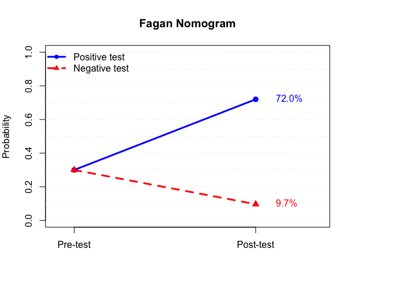

<!-- badges: start -->

[](https://github.com/rmcgill777/ebatools/actions/workflows/R-CMD-check.yaml)
<!-- badges: end -->

<!-- README.md is generated from README.Rmd. Please edit that file -->

# ebaTools

`ebaTools` provides functions for evidence-based assessment of
diagnostic tests. The package includes tools for calculating diagnostic
accuracy statistics, performing Bayesian updating, interpreting
likelihood ratios, and visualizing results with a Fagan nomogram.

## Installation

### CRAN

``` r
install.packages("ebaTools")
```

### Development version

``` r
# install.packages("remotes")
remotes::install_github("rmcgill777/ebaTools")
```

## Example

``` r
library(ebaTools)

# Calculate diagnostic accuracy statistics
stats <- eba_stats(
  tp = 45,
  fp = 12,
  fn = 5,
  tn = 138
)

stats
#> $table
#>           Condition
#> Test       Positive Negative
#>   Positive       45       12
#>   Negative        5      138
#> 
#> $sensitivity
#> [1] 0.9
#> 
#> $specificity
#> [1] 0.92
#> 
#> $ppv
#> [1] 0.7894737
#> 
#> $npv
#> [1] 0.965035
#> 
#> $lr_positive
#> [1] 11.25
#> 
#> $lr_negative
#> [1] 0.1086957
#> 
#> $log_lr_positive
#> [1] 2.420368
#> 
#> $log_lr_negative
#> [1] -2.219203
#> 
#> $dor
#> [1] 103.5
#> 
#> $prevalence
#> [1] 0.25
#> 
#> $auc
#> [1] 0.91
#> 
#> attr(,"class")
#> [1] "eba_stats"

# Update pretest probability using likelihood ratios
results <- bayes_update(
  pretest_probability = 0.30,
  lr_positive = 6,
  lr_negative = 0.25
)

results
#> $pretest_probability
#> [1] 0.3
#> 
#> $post_positive
#> [1] 0.72
#> 
#> $post_negative
#> [1] 0.09677419
#> 
#> attr(,"class")
#> [1] "bayes_update"

# Interpret the positive post-test probability
eba_interpretation(
  post_probability = results$post_positive
)
#> $post_probability
#> [1] 0.72
#> 
#> $wait_threshold
#> [1] 0.1
#> 
#> $treat_threshold
#> [1] 0.7
#> 
#> $interpretation
#> [1] "High probability: Condition likely present. Consider initiating treatment."
#> 
#> attr(,"class")
#> [1] "eba_interpretation"

# Create a Fagan nomogram
fagan_nomogram(
  pretest_probability = 0.30,
  lr_positive = 6,
  lr_negative = 0.25
)
```



## Main Functions

| Function | Description |
|----|----|
| `eba_stats()` | Calculate diagnostic accuracy statistics from a 2 × 2 contingency table. |
| `bayes_update()` | Update disease probability using Bayes’ theorem and a likelihood ratio. |
| `eba_interpretation()` | Provide an evidence-based interpretation of likelihood ratios. |
| `fagan_nomogram()` | Visualize Bayesian updating with a Fagan nomogram. |
